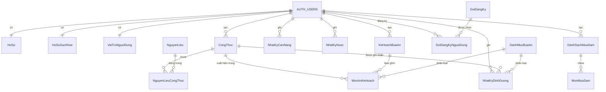

# 📊 TÀI LIỆU SCHEMA DATABASE - ĐỒ ÁN TỐT NGHIỆP

## Hệ thống Quản lý Dinh dưỡng & Sức khỏe

---

## 1. TỔNG QUAN HỆ THỐNG

### Mục đích
Database được thiết kế để quản lý toàn diện hệ thống dinh dưỡng cá nhân hóa, bao gồm:
- ✅ Quản lý người dùng và hồ sơ sức khỏe
- ✅ Quản lý công thức nấu ăn và nguyên liệu
- ✅ Lập kế hoạch bữa ăn
- ✅ Theo dõi dinh dưỡng, cân nặng, nước uống
- ✅ Danh sách mua sắm thông minh
- ✅ Hệ thống đăng ký gói dịch vụ

### Công nghệ sử dụng
- **Database**: PostgreSQL 15+ (Supabase)
- **Authentication**: Supabase Auth (auth.users)
- **ORM**: Supabase JavaScript Client
- **Security**: Row Level Security (RLS)

---

## 2. SƠ ĐỒ ENTITY RELATIONSHIP DIAGRAM (ERD)



---

## 3. CHI TIẾT CÁC BẢNG

### 🧑 3.1. MODULE NGƯỜI DÙNG

#### **HoSo** (Profiles)
Lưu thông tin cá nhân của người dùng.

| Cột | Kiểu | Ràng buộc | Mô tả |
|-----|------|-----------|-------|
| id | uuid | PK, DEFAULT gen_random_uuid() | ID hồ sơ |
| nguoidungid | uuid | FK → auth.users(id) CASCADE, NOT NULL | ID người dùng |
| hoten | text | NULL | Họ và tên |
| email | text | NULL | Email |
| sodienthoai | text | NULL | Số điện thoại |
| ngaysinh | date | NULL | Ngày sinh |
| gioitinh | text | NULL | Giới tính |
| anhdaidien | text | NULL | URL ảnh đại diện |
| taoluc | timestamp | NOT NULL, DEFAULT now() | Thời điểm tạo |
| capnhatluc | timestamp | NOT NULL, DEFAULT now() | Thời điểm cập nhật |

**Foreign Keys:**
```sql
HoSo.nguoidungid → auth.users.id (ON DELETE CASCADE)
```

**Indexes:**
```sql
CREATE INDEX idx_hoso_nguoidungid ON HoSo(nguoidungid);
```

**RLS Policies:**
- Users can view/update their own profile
- Auto-insert trigger on user signup

---

#### **HoSoSucKhoe** (Health Profiles)
Lưu thông tin sức khỏe chi tiết.

| Cột | Kiểu | Ràng buộc | Mô tả |
|-----|------|-----------|-------|
| id | uuid | PK, DEFAULT gen_random_uuid() | ID hồ sơ sức khỏe |
| nguoidungid | uuid | FK → auth.users(id) CASCADE, NOT NULL | ID người dùng |
| chieucao | numeric | NULL | Chiều cao (cm) |
| cannang | numeric | NULL | Cân nặng (kg) |
| mucdohoatdong | text | NULL | Mức độ hoạt động |
| muctieucalohangngay | integer | NULL | Mục tiêu calo/ngày |
| muctieusuckhoe | text[] | DEFAULT '{}' | Mục tiêu sức khỏe |
| hanchechedo | text[] | DEFAULT '{}' | Hạn chế chế độ ăn |
| diung | text[] | DEFAULT '{}' | Dị ứng thực phẩm |
| tinhtrangsuckhoe | text[] | DEFAULT '{}' | Tình trạng sức khỏe |
| taoluc | timestamp | NOT NULL, DEFAULT now() | Thời điểm tạo |
| capnhatluc | timestamp | NOT NULL, DEFAULT now() | Thời điểm cập nhật |

**Foreign Keys:**
```sql
HoSoSucKhoe.nguoidungid → auth.users.id (ON DELETE CASCADE)
```

---

#### **VaiTroNguoiDung** (User Roles)
Quản lý vai trò và quyền hạn.

| Cột | Kiểu | Ràng buộc | Mô tả |
|-----|------|-----------|-------|
| id | uuid | PK, DEFAULT gen_random_uuid() | ID vai trò |
| nguoidungid | uuid | FK → auth.users(id) CASCADE, NOT NULL | ID người dùng |
| vaitro | app_role | NOT NULL, DEFAULT 'user' | Vai trò (admin/user) |
| taoluc | timestamp | NOT NULL, DEFAULT now() | Thời điểm tạo |

**Foreign Keys:**
```sql
VaiTroNguoiDung.nguoidungid → auth.users.id (ON DELETE CASCADE)
```

**Security Function:**
```sql
CREATE FUNCTION has_role(_user_id uuid, _role app_role)
RETURNS boolean AS $$
  SELECT EXISTS (
    SELECT 1 FROM VaiTroNguoiDung
    WHERE nguoidungid = _user_id AND vaitro = _role
  )
$$ LANGUAGE sql SECURITY DEFINER;
```

---

### 🍳 3.2. MODULE CÔNG THỨC NẤU ĂN

#### **CongThuc** (Recipes)
Lưu công thức nấu ăn.

| Cột | Kiểu | Ràng buộc | Mô tả |
|-----|------|-----------|-------|
| id | uuid | PK, DEFAULT gen_random_uuid() | ID công thức |
| nguoitao | uuid | FK → auth.users(id) SET NULL | Người tạo |
| ten | text | NOT NULL | Tên công thức |
| mota | text | NULL | Mô tả ngắn |
| huongdan | jsonb | NULL | Hướng dẫn chi tiết |
| thoigianchuanbi | integer | NULL | Thời gian chuẩn bị (phút) |
| thoigiannau | integer | NULL | Thời gian nấu (phút) |
| khauphan | integer | DEFAULT 1 | Số khẩu phần |
| tongcalo | numeric | NULL | Tổng calo |
| tongdam | numeric | NULL | Tổng đạm (g) |
| tongcarb | numeric | NULL | Tổng carb (g) |
| tongchat | numeric | NULL | Tổng chất xơ (g) |
| congkhai | boolean | DEFAULT false | Công khai hay không |
| anhdaidien | text | NULL | URL ảnh đại diện |
| dokho | text | NULL | Độ khó (dễ/trung bình/khó) |
| taoluc | timestamp | NOT NULL, DEFAULT now() | Thời điểm tạo |
| capnhatluc | timestamp | NOT NULL, DEFAULT now() | Thời điểm cập nhật |

**Foreign Keys:**
```sql
CongThuc.nguoitao → auth.users.id (ON DELETE SET NULL)
-- SET NULL để giữ recipe khi user bị xóa
```

**RLS Policies:**
```sql
-- Users can view public recipes and their own
CREATE POLICY "view_recipes" ON CongThuc
FOR SELECT USING (congkhai = true OR auth.uid() = nguoitao);

-- Users can create their own recipes
CREATE POLICY "create_recipes" ON CongThuc
FOR INSERT WITH CHECK (auth.uid() = nguoitao);

-- Users can update/delete their own recipes
CREATE POLICY "modify_recipes" ON CongThuc
FOR UPDATE/DELETE USING (auth.uid() = nguoitao);
```

---

#### **NguyenLieu** (Ingredients)
Danh mục nguyên liệu.

| Cột | Kiểu | Ràng buộc | Mô tả |
|-----|------|-----------|-------|
| id | uuid | PK, DEFAULT gen_random_uuid() | ID nguyên liệu |
| ten | text | NOT NULL | Tên nguyên liệu |
| calo100g | numeric | NULL | Calo/100g |
| dam100g | numeric | NULL | Đạm/100g |
| carb100g | numeric | NULL | Carb/100g |
| chat100g | numeric | NULL | Chất xơ/100g |
| xo100g | numeric | NULL | Chất béo/100g |
| duong100g | numeric | NULL | Đường/100g |
| natri100g | numeric | NULL | Natri/100g |
| taoluc | timestamp | NOT NULL, DEFAULT now() | Thời điểm tạo |

**RLS Policies:**
- Public read access (everyone can view)
- Only admins can modify

---

#### **NguyenLieuCongThuc** (Recipe Ingredients)
Liên kết nguyên liệu với công thức.

| Cột | Kiểu | Ràng buộc | Mô tả |
|-----|------|-----------|-------|
| id | uuid | PK, DEFAULT gen_random_uuid() | ID |
| congthucid | uuid | FK → CongThuc(id) CASCADE | ID công thức |
| nguyenlieuid | uuid | FK → NguyenLieu(id) CASCADE | ID nguyên liệu |
| soluong | numeric | NOT NULL | Số lượng |
| donvi | text | NOT NULL | Đơn vị (g/ml/muỗng...) |

**Foreign Keys:**
```sql
NguyenLieuCongThuc.congthucid → CongThuc.id (ON DELETE CASCADE)
NguyenLieuCongThuc.nguyenlieuid → NguyenLieu.id (ON DELETE CASCADE)
-- Xóa recipe → tự động xóa tất cả ingredients relationship
```

---

### 🗓️ 3.3. MODULE KẾ HOẠCH BỮA ĂN

#### **KeHoachBuaAn** (Meal Plans)
Kế hoạch ăn uống của người dùng.

| Cột | Kiểu | Ràng buộc | Mô tả |
|-----|------|-----------|-------|
| id | uuid | PK, DEFAULT gen_random_uuid() | ID kế hoạch |
| nguoidungid | uuid | FK → auth.users(id) CASCADE, NOT NULL | ID người dùng |
| ten | text | NOT NULL | Tên kế hoạch |
| mota | text | NULL | Mô tả |
| ngaybatdau | date | NULL | Ngày bắt đầu |
| ngayketthuc | date | NULL | Ngày kết thúc |
| muctieucalo | integer | NULL | Mục tiêu calo |
| danghoatdong | boolean | DEFAULT true | Đang hoạt động |
| taoluc | timestamp | NOT NULL, DEFAULT now() | Thời điểm tạo |
| capnhatluc | timestamp | NOT NULL, DEFAULT now() | Thời điểm cập nhật |

**Foreign Keys:**
```sql
KeHoachBuaAn.nguoidungid → auth.users.id (ON DELETE CASCADE)
```

---

#### **MonAnKeHoach** (Meal Plan Items)
Chi tiết món ăn trong kế hoạch.

| Cột | Kiểu | Ràng buộc | Mô tả |
|-----|------|-----------|-------|
| id | uuid | PK, DEFAULT gen_random_uuid() | ID món ăn |
| kehoachid | uuid | FK → KeHoachBuaAn(id) CASCADE | ID kế hoạch |
| congthucid | uuid | FK → CongThuc(id) SET NULL | ID công thức |
| danhmucid | uuid | FK → DanhMucBuaAn(id) SET NULL | Danh mục bữa ăn |
| ngaydukien | date | NOT NULL | Ngày dự kiến |
| giodukien | time | NULL | Giờ dự kiến |
| khauphan | numeric | DEFAULT 1 | Số khẩu phần |
| taoluc | timestamp | NOT NULL, DEFAULT now() | Thời điểm tạo |

**Foreign Keys:**
```sql
MonAnKeHoach.kehoachid → KeHoachBuaAn.id (ON DELETE CASCADE)
MonAnKeHoach.congthucid → CongThuc.id (ON DELETE SET NULL)
MonAnKeHoach.danhmucid → DanhMucBuaAn.id (ON DELETE SET NULL)
-- Xóa meal plan → xóa tất cả items
-- Xóa recipe → item vẫn tồn tại (congthucid = null)
```

---

#### **DanhMucBuaAn** (Meal Categories)
Danh mục bữa ăn (sáng/trưa/tối/phụ).

| Cột | Kiểu | Ràng buộc | Mô tả |
|-----|------|-----------|-------|
| id | uuid | PK, DEFAULT gen_random_uuid() | ID danh mục |
| ten | text | NOT NULL | Tên (Sáng/Trưa/Tối/Phụ) |
| mota | text | NULL | Mô tả |
| thutuhienthi | integer | DEFAULT 0 | Thứ tự hiển thị |
| taoluc | timestamp | NOT NULL, DEFAULT now() | Thời điểm tạo |

**Data mẫu:**
```sql
INSERT INTO DanhMucBuaAn (ten, thutuhienthi) VALUES
  ('Bữa sáng', 1),
  ('Bữa trưa', 2),
  ('Bữa tối', 3),
  ('Bữa phụ', 4);
```

---

### 📊 3.4. MODULE THEO DÕI DINH DƯỠNG

#### **NhatKyDinhDuong** (Nutrition Logs)
Nhật ký theo dõi dinh dưỡng hàng ngày.

| Cột | Kiểu | Ràng buộc | Mô tả |
|-----|------|-----------|-------|
| id | uuid | PK, DEFAULT gen_random_uuid() | ID nhật ký |
| nguoidungid | uuid | FK → auth.users(id) CASCADE, NOT NULL | ID người dùng |
| ngayghinhan | date | NOT NULL | Ngày ghi nhận |
| tenthucpham | text | NULL | Tên thực phẩm (nếu nhập tay) |
| congthucid | uuid | FK → CongThuc(id) SET NULL | ID công thức |
| danhmucid | uuid | FK → DanhMucBuaAn(id) SET NULL | Danh mục bữa ăn |
| soluong | numeric | NULL | Số lượng |
| donvi | text | NULL | Đơn vị |
| calo | numeric | NULL | Calo |
| dam | numeric | NULL | Đạm (g) |
| carb | numeric | NULL | Carb (g) |
| chat | numeric | NULL | Chất xơ (g) |
| ghichu | text | NULL | Ghi chú |
| taoluc | timestamp | NOT NULL, DEFAULT now() | Thời điểm tạo |

**Foreign Keys:**
```sql
NhatKyDinhDuong.nguoidungid → auth.users.id (ON DELETE CASCADE)
NhatKyDinhDuong.congthucid → CongThuc.id (ON DELETE SET NULL)
NhatKyDinhDuong.danhmucid → DanhMucBuaAn.id (ON DELETE SET NULL)
```

**Indexes:**
```sql
CREATE INDEX idx_nhatkydinhduong_nguoidungid ON NhatKyDinhDuong(nguoidungid);
CREATE INDEX idx_nhatkydinhduong_ngayghinhan ON NhatKyDinhDuong(ngayghinhan);
```

---

#### **NhatKyCanNang** (Weight Logs)
Nhật ký theo dõi cân nặng.

| Cột | Kiểu | Ràng buộc | Mô tả |
|-----|------|-----------|-------|
| id | uuid | PK, DEFAULT gen_random_uuid() | ID nhật ký |
| nguoidungid | uuid | FK → auth.users(id) CASCADE, NOT NULL | ID người dùng |
| cannang | numeric | NOT NULL | Cân nặng (kg) |
| ngayghinhan | date | NOT NULL, DEFAULT CURRENT_DATE | Ngày ghi nhận |
| ghichu | text | NULL | Ghi chú |
| taoluc | timestamp | NOT NULL, DEFAULT now() | Thời điểm tạo |

**Foreign Keys:**
```sql
NhatKyCanNang.nguoidungid → auth.users.id (ON DELETE CASCADE)
```

---

#### **NhatKyNuoc** (Water Logs)
Nhật ký theo dõi lượng nước uống.

| Cột | Kiểu | Ràng buộc | Mô tả |
|-----|------|-----------|-------|
| id | uuid | PK, DEFAULT gen_random_uuid() | ID nhật ký |
| nguoidungid | uuid | FK → auth.users(id) CASCADE, NOT NULL | ID người dùng |
| soluongml | integer | NOT NULL | Số lượng (ml) |
| ngayghinhan | date | NOT NULL, DEFAULT CURRENT_DATE | Ngày ghi nhận |
| gioghinhan | time | NOT NULL, DEFAULT CURRENT_TIME | Giờ ghi nhận |
| taoluc | timestamp | NOT NULL, DEFAULT now() | Thời điểm tạo |

**Foreign Keys:**
```sql
NhatKyNuoc.nguoidungid → auth.users.id (ON DELETE CASCADE)
```

---

### 🛒 3.5. MODULE DANH SÁCH MUA SẮM

#### **DanhSachMuaSam** (Shopping Lists)
Danh sách mua sắm của người dùng.

| Cột | Kiểu | Ràng buộc | Mô tả |
|-----|------|-----------|-------|
| id | uuid | PK, DEFAULT gen_random_uuid() | ID danh sách |
| nguoidungid | uuid | FK → auth.users(id) CASCADE, NOT NULL | ID người dùng |
| ten | text | NOT NULL | Tên danh sách |
| taoluc | timestamp | NOT NULL, DEFAULT now() | Thời điểm tạo |
| capnhatluc | timestamp | NOT NULL, DEFAULT now() | Thời điểm cập nhật |

**Foreign Keys:**
```sql
DanhSachMuaSam.nguoidungid → auth.users.id (ON DELETE CASCADE)
```

---

#### **MonMuaSam** (Shopping Items)
Các món trong danh sách mua sắm.

| Cột | Kiểu | Ràng buộc | Mô tả |
|-----|------|-----------|-------|
| id | uuid | PK, DEFAULT gen_random_uuid() | ID món |
| danhsachid | uuid | FK → DanhSachMuaSam(id) CASCADE, NOT NULL | ID danh sách |
| tennguyenlieu | text | NOT NULL | Tên nguyên liệu |
| soluong | numeric | NOT NULL | Số lượng |
| donvi | text | NOT NULL | Đơn vị |
| damua | boolean | DEFAULT false | Đã mua chưa |
| taoluc | timestamp | NOT NULL, DEFAULT now() | Thời điểm tạo |

**Foreign Keys:**
```sql
MonMuaSam.danhsachid → DanhSachMuaSam.id (ON DELETE CASCADE)
-- Xóa shopping list → tự động xóa tất cả items
```

---

### 💳 3.6. MODULE GÓI ĐĂNG KÝ

#### **GoiDangKy** (Subscription Plans)
Các gói đăng ký dịch vụ.

| Cột | Kiểu | Ràng buộc | Mô tả |
|-----|------|-----------|-------|
| id | uuid | PK, DEFAULT gen_random_uuid() | ID gói |
| ten | text | NOT NULL | Tên gói |
| mota | text | NULL | Mô tả |
| giathang | numeric | NULL | Giá theo tháng |
| gianam | numeric | NULL | Giá theo năm |
| tinhnang | jsonb | DEFAULT '[]' | Tính năng (JSON array) |
| sokehoachtoida | integer | NULL | Số kế hoạch tối đa |
| socongthuctoida | integer | NULL | Số công thức tối đa |
| danghoatdong | boolean | DEFAULT true | Đang hoạt động |
| taoluc | timestamp | NOT NULL, DEFAULT now() | Thời điểm tạo |

---

#### **GoiDangKyNguoiDung** (User Subscriptions)
Đăng ký gói của người dùng.

| Cột | Kiểu | Ràng buộc | Mô tả |
|-----|------|-----------|-------|
| id | uuid | PK, DEFAULT gen_random_uuid() | ID đăng ký |
| nguoidungid | uuid | FK → auth.users(id) CASCADE, NOT NULL | ID người dùng |
| goidangkyid | uuid | FK → GoiDangKy(id) SET NULL | ID gói đăng ký |
| batdauky | timestamp | NULL | Bắt đầu kỳ |
| ketthucky | timestamp | NULL | Kết thúc kỳ |
| trangthai | text | NULL | Trạng thái (active/expired/cancelled) |
| stripekhachhangid | text | NULL | Stripe Customer ID |
| stripedangkyid | text | NULL | Stripe Subscription ID |
| taoluc | timestamp | NOT NULL, DEFAULT now() | Thời điểm tạo |
| capnhatluc | timestamp | NOT NULL, DEFAULT now() | Thời điểm cập nhật |

**Foreign Keys:**
```sql
GoiDangKyNguoiDung.nguoidungid → auth.users.id (ON DELETE CASCADE)
GoiDangKyNguoiDung.goidangkyid → GoiDangKy.id (ON DELETE SET NULL)
-- Giữ subscription history khi plan bị xóa
```

---

## 4. TRIGGERS VÀ FUNCTIONS

### 4.1. Auto-update Timestamps

```sql
-- Function để tự động update capnhatluc
CREATE OR REPLACE FUNCTION update_capnhatluc_column()
RETURNS TRIGGER AS $$
BEGIN
  NEW.capnhatluc = now();
  RETURN NEW;
END;
$$ LANGUAGE plpgsql SECURITY DEFINER;

-- Trigger cho các bảng cần auto-update
CREATE TRIGGER update_hoso_capnhatluc
  BEFORE UPDATE ON HoSo
  FOR EACH ROW EXECUTE FUNCTION update_capnhatluc_column();

CREATE TRIGGER update_hososuckhoe_capnhatluc
  BEFORE UPDATE ON HoSoSucKhoe
  FOR EACH ROW EXECUTE FUNCTION update_capnhatluc_column();

-- ... (tương tự cho các bảng khác)
```

### 4.2. Auto-create Profile on User Signup

```sql
CREATE OR REPLACE FUNCTION handle_new_user()
RETURNS TRIGGER AS $$
BEGIN
  -- Tạo HoSo
  INSERT INTO public.HoSo (nguoidungid, hoten, email)
  VALUES (NEW.id, COALESCE(NEW.raw_user_meta_data->>'full_name', ''), NEW.email);
  
  -- Tạo HoSoSucKhoe
  INSERT INTO public.HoSoSucKhoe (nguoidungid)
  VALUES (NEW.id);
  
  -- Tạo VaiTroNguoiDung
  INSERT INTO public.VaiTroNguoiDung (nguoidungid, vaitro)
  VALUES (NEW.id, 'user');
  
  RETURN NEW;
END;
$$ LANGUAGE plpgsql SECURITY DEFINER;

-- Trigger khi user mới đăng ký
CREATE TRIGGER on_auth_user_created
  AFTER INSERT ON auth.users
  FOR EACH ROW EXECUTE FUNCTION handle_new_user();
```

---

## 5. INDEXES CHO PERFORMANCE

```sql
-- User-related indexes
CREATE INDEX idx_hoso_nguoidungid ON HoSo(nguoidungid);
CREATE INDEX idx_hososuckhoe_nguoidungid ON HoSoSucKhoe(nguoidungid);
CREATE INDEX idx_vaitronguoidung_nguoidungid ON VaiTroNguoiDung(nguoidungid);

-- Recipe-related indexes
CREATE INDEX idx_congthuc_nguoitao ON CongThuc(nguoitao);
CREATE INDEX idx_nguyenlieucongthuc_congthucid ON NguyenLieuCongThuc(congthucid);
CREATE INDEX idx_nguyenlieucongthuc_nguyenlieuid ON NguyenLieuCongThuc(nguyenlieuid);

-- Meal plan indexes
CREATE INDEX idx_kehoachbuaan_nguoidungid ON KeHoachBuaAn(nguoidungid);
CREATE INDEX idx_monankehoach_kehoachid ON MonAnKeHoach(kehoachid);
CREATE INDEX idx_monankehoach_congthucid ON MonAnKeHoach(congthucid);

-- Nutrition tracking indexes
CREATE INDEX idx_nhatkydinhduong_nguoidungid ON NhatKyDinhDuong(nguoidungid);
CREATE INDEX idx_nhatkydinhduong_ngayghinhan ON NhatKyDinhDuong(ngayghinhan);
CREATE INDEX idx_nhatkycannang_nguoidungid ON NhatKyCanNang(nguoidungid);
CREATE INDEX idx_nhatkynuoc_nguoidungid ON NhatKyNuoc(nguoidungid);

-- Shopping list indexes
CREATE INDEX idx_danhsachmuasam_nguoidungid ON DanhSachMuaSam(nguoidungid);
CREATE INDEX idx_monmuasam_danhsachid ON MonMuaSam(danhsachid);
```

---

## 6. ROW LEVEL SECURITY (RLS)

### Nguyên tắc bảo mật:
1. ✅ Users chỉ xem được dữ liệu của mình
2. ✅ Public recipes có thể được mọi người xem
3. ✅ Admin có quyền xem tất cả (qua security definer functions)
4. ✅ Cascade deletes đảm bảo data integrity

### Ví dụ RLS Policies:

```sql
-- HoSo: Users can only view/update their own profile
CREATE POLICY "view_own_profile" ON HoSo
FOR SELECT USING (auth.uid() = nguoidungid);

CREATE POLICY "update_own_profile" ON HoSo
FOR UPDATE USING (auth.uid() = nguoidungid);

-- CongThuc: View public + own recipes
CREATE POLICY "view_recipes" ON CongThuc
FOR SELECT USING (congkhai = true OR auth.uid() = nguoitao);

-- NhatKyDinhDuong: Full access to own logs
CREATE POLICY "manage_own_logs" ON NhatKyDinhDuong
FOR ALL USING (auth.uid() = nguoidungid);
```

---

## 7. BEST PRACTICES ĐÃ ÁP DỤNG

### ✅ 7.1. Foreign Key Constraints
- Tất cả 16 relationships đều có FK constraints
- ON DELETE CASCADE cho user data
- ON DELETE SET NULL cho optional references
- Đảm bảo referential integrity

### ✅ 7.2. Indexes
- 18 indexes cho performance
- Index trên tất cả foreign keys
- Index trên các cột thường query (ngayghinhan, taoluc)
- Tăng tốc độ JOIN operations

### ✅ 7.3. Triggers
- Auto-update timestamps
- Auto-create user profiles on signup
- Maintain data consistency

### ✅ 7.4. Security
- RLS enabled trên tất cả tables
- Security definer functions cho admin checks
- Prevent SQL injection via parameterized queries

### ✅ 7.5. Data Types
- UUID cho primary keys (better distribution)
- JSONB cho flexible data (huongdan, tinhnang)
- Text arrays cho multi-select fields (diung, muctieusuckhoe)
- Timestamp with timezone cho time tracking

---

## 8. TESTING CHECKLIST

### Data Integrity Tests:
- [ ] Xóa user → Tất cả related data bị xóa
- [ ] Xóa recipe → Ingredients relationships bị xóa
- [ ] Xóa recipe → Meal plan items vẫn tồn tại (recipe_id = null)
- [ ] Xóa meal plan → Items tự động xóa
- [ ] Xóa shopping list → Items tự động xóa

### Security Tests:
- [ ] User A không xem được profile của User B
- [ ] User A không xem được private recipes của User B
- [ ] Public recipes visible to everyone
- [ ] Admin có thể xem tất cả data

### Performance Tests:
- [ ] Query với JOINs < 100ms
- [ ] Indexes đang hoạt động (EXPLAIN ANALYZE)
- [ ] No N+1 query problems

---

## 9. FRONTEND INTEGRATION

### Ví dụ query với JOINs:

```typescript
// ✅ ĐÚNG - Sử dụng JOINs
const { data } = await supabase
  .from('CongThuc')
  .select(`
    *,
    NguyenLieuCongThuc (
      id,
      soluong,
      donvi,
      NguyenLieu (id, ten, calo100g)
    ),
    HoSo!CongThuc_nguoitao_fkey (hoten, anhdaidien)
  `)
  .eq('id', recipeId);

// ❌ SAI - Multiple queries
const recipe = await getRecipe(id);
const ingredients = await getIngredients(id);
const author = await getAuthor(recipe.nguoitao);
```

---

## 10. MIGRATION HISTORY

| Version | Date | Changes |
|---------|------|---------|
| v1.0 | 2025-11-09 | Initial schema with all tables |
| v1.1 | 2025-11-09 | Added foreign key constraints |
| v1.2 | 2025-11-09 | Fixed timestamp triggers (capnhatluc) |
| v1.3 | 2025-11-09 | Added performance indexes |

---

## 📚 TÀI LIỆU THAM KHẢO

- [PostgreSQL Foreign Keys](https://www.postgresql.org/docs/current/ddl-constraints.html#DDL-CONSTRAINTS-FK)
- [Supabase Row Level Security](https://supabase.com/docs/guides/auth/row-level-security)
- [Database Normalization](https://en.wikipedia.org/wiki/Database_normalization)

---

**Ghi chú cho đồ án:**
- ✅ Database đã được thiết kế chuẩn 3NF
- ✅ Tất cả relationships có foreign keys
- ✅ RLS policies đảm bảo data security
- ✅ Indexes tối ưu performance
- ✅ Triggers đảm bảo data consistency
- ✅ Sẵn sàng cho môi trường production
