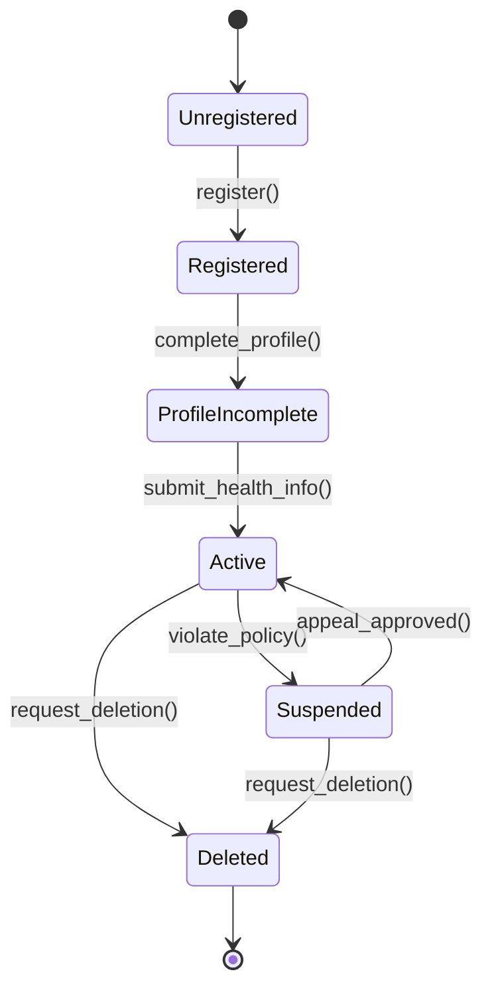
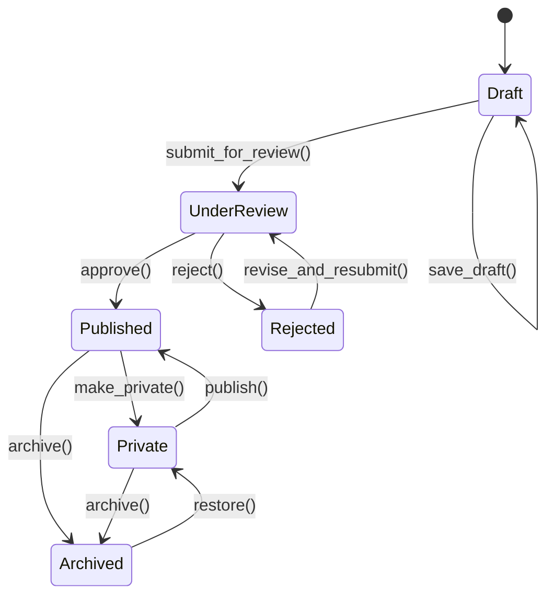
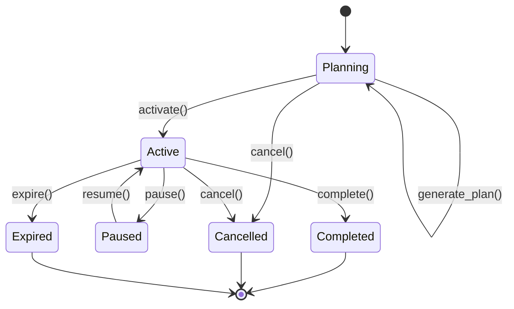
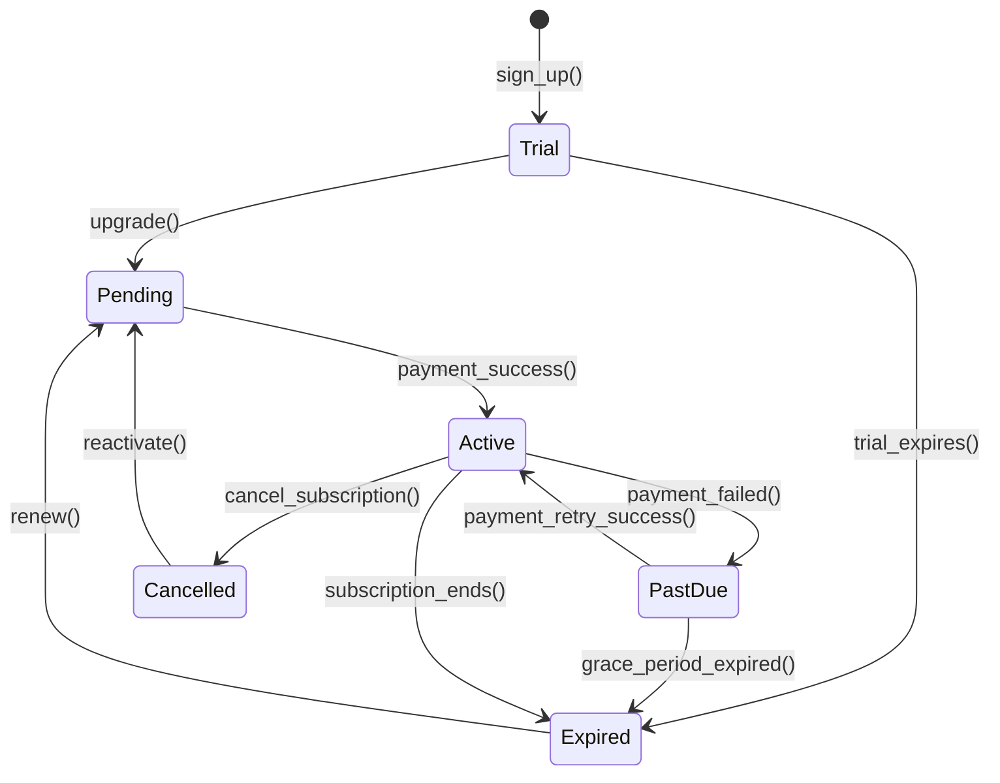
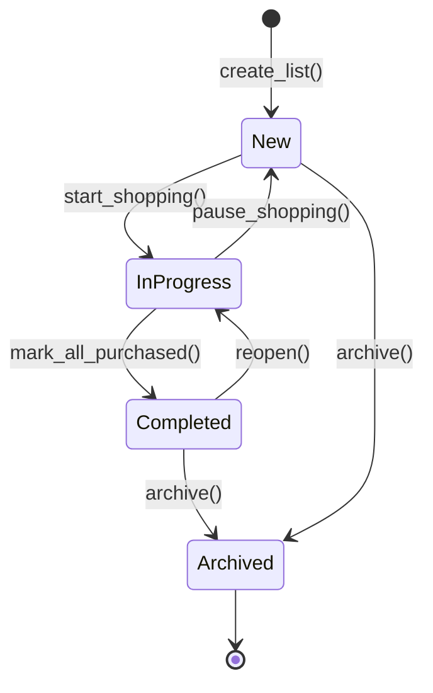
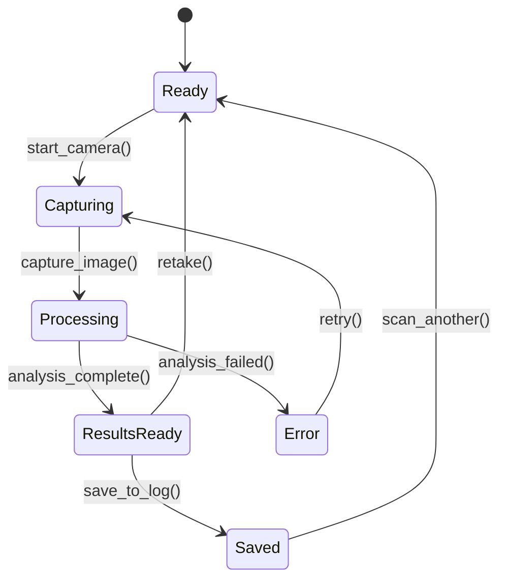

# STATE MACHINE DIAGRAMS

## Tổng quan
Document này mô tả các State Machine Diagrams cho các thực thể chính trong hệ thống Nutrition App.

---

## 1. USER ACCOUNT STATE MACHINE

### States (Trạng thái)
1. **Unregistered** (Chưa đăng ký)
2. **Registered** (Đã đăng ký)
3. **Profile Incomplete** (Hồ sơ chưa đầy đủ)
4. **Active** (Đang hoạt động)
5. **Suspended** (Bị tạm ngưng)
6. **Deleted** (Đã xóa)

### Transitions (Chuyển trạng thái)

| From State | Event | To State | Condition | Action |
|------------|-------|----------|-----------|--------|
| Unregistered | register() | Registered | Valid email/phone | Create auth.users record |
| Registered | complete_profile() | Profile Incomplete | - | Create HoSo record |
| Profile Incomplete | submit_health_info() | Active | All required fields filled | Create HoSoSucKhoe, assign free plan |
| Active | violate_policy() | Suspended | Admin action | Disable access |
| Suspended | appeal_approved() | Active | Admin approval | Restore access |
| Active | request_deletion() | Deleted | User confirmation | Soft delete or hard delete |
| Suspended | request_deletion() | Deleted | User confirmation | Soft delete or hard delete |

### State Attributes

**Active State:**
- Can create recipes
- Can create meal plans
- Can log nutrition
- Can access AI features (based on subscription)

**Suspended State:**
- Cannot create new content
- Can view existing data (read-only)
- Cannot use AI features

---

## 2. RECIPE (CONGTHUC) STATE MACHINE

### States
1. **Draft** (Bản nháp)
2. **Under Review** (Đang xem xét)
3. **Published** (Đã công khai)
4. **Private** (Riêng tư)
5. **Archived** (Đã lưu trữ)
6. **Rejected** (Bị từ chối)

### Transitions

| From State | Event | To State | Condition | Action |
|------------|-------|----------|-----------|--------|
| Draft | save_draft() | Draft | - | Save to CongThuc (congkhai=false) |
| Draft | submit_for_review() | Under Review | Complete recipe data | Set congkhai=false, notify admin |
| Under Review | approve() | Published | Admin approval | Set congkhai=true |
| Under Review | reject() | Rejected | Admin action | Add rejection reason |
| Rejected | revise_and_resubmit() | Under Review | User edits | Update CongThuc |
| Published | make_private() | Private | Creator action | Set congkhai=false |
| Private | publish() | Published | Creator action | Set congkhai=true |
| Published | archive() | Archived | Creator/Admin action | Mark as archived |
| Private | archive() | Archived | Creator/Admin action | Mark as archived |
| Archived | restore() | Private | Creator/Admin action | Remove archived flag |

### State Attributes

**Draft:**
- Visible only to creator
- Can be edited freely
- Not searchable by others

**Published:**
- Visible to all users
- Searchable
- Can be added to meal plans
- Cannot be deleted if used in active meal plans

**Archived:**
- Not visible in search
- Still accessible via direct link
- Cannot be added to new meal plans

---

## 3. MEAL PLAN (KEHOACHBUAAN) STATE MACHINE

### States
1. **Planning** (Đang lên kế hoạch)
2. **Active** (Đang hoạt động)
3. **Paused** (Tạm dừng)
4. **Completed** (Đã hoàn thành)
5. **Cancelled** (Đã hủy)
6. **Expired** (Đã hết hạn)

### Transitions

| From State | Event | To State | Condition | Action |
|------------|-------|----------|-----------|--------|
| Planning | generate_plan() | Planning | AI/Manual creation | Create MonAnKeHoach records |
| Planning | activate() | Active | Start date reached, has meals | Set danghoatdong=true |
| Active | pause() | Paused | User action | Set danghoatdong=false |
| Paused | resume() | Active | User action | Set danghoatdong=true |
| Active | complete() | Completed | End date reached | Set danghoatdong=false |
| Active | cancel() | Cancelled | User action | Set danghoatdong=false |
| Planning | cancel() | Cancelled | User action | Delete plan |
| Active | expire() | Expired | End date passed + grace period | Set danghoatdong=false |

### State Attributes

**Active:**
- Displayed in dashboard
- Meals can be logged to nutrition diary
- Can modify meals
- Sends notifications

**Paused:**
- Not displayed in active plans
- Can resume anytime
- Meals preserved
- No notifications

**Completed:**
- Read-only
- Can be duplicated
- Statistics available

---

## 4. SUBSCRIPTION (GOIDANGKYNGUOIDUNG) STATE MACHINE

### States
1. **Pending** (Chờ xử lý)
2. **Active** (Đang hoạt động)
3. **Past Due** (Quá hạn thanh toán)
4. **Cancelled** (Đã hủy)
5. **Expired** (Đã hết hạn)
6. **Trial** (Dùng thử)

### Transitions

| From State | Event | To State | Condition | Action |
|------------|-------|----------|-----------|--------|
| - | sign_up() | Trial | New user | Assign free plan, set trial period |
| Trial | upgrade() | Pending | User selects paid plan | Create Stripe checkout |
| Pending | payment_success() | Active | Payment confirmed | Set trangthai='active', set dates |
| Active | payment_failed() | Past Due | Auto-renewal failed | Set trangthai='past_due', send notification |
| Past Due | payment_retry_success() | Active | Payment successful | Set trangthai='active' |
| Past Due | grace_period_expired() | Expired | 7 days no payment | Set trangthai='expired', downgrade features |
| Active | cancel_subscription() | Cancelled | User/Admin action | Set trangthai='cancelled', set ketthucky |
| Active | subscription_ends() | Expired | End date reached | Set trangthai='expired' |
| Trial | trial_expires() | Expired | Trial period ends | Set trangthai='expired', assign free plan |
| Expired | renew() | Pending | User action | Create new subscription |
| Cancelled | reactivate() | Pending | User action | Create new subscription |

### State Attributes

**Active:**
- Full feature access based on plan
- AI features enabled
- Premium recipe access
- Unlimited meal plans

**Trial:**
- Limited feature access
- Limited AI usage
- Limited recipes
- Time-limited

**Past Due:**
- Limited access
- Read-only mode for some features
- Urgent payment reminders

**Expired:**
- Basic features only
- No AI access
- Limited to free plan features

---

## 5. SHOPPING LIST (DANHSACHMUASAM) STATE MACHINE

### States
1. **New** (Mới)
2. **In Progress** (Đang mua)
3. **Completed** (Đã hoàn thành)
4. **Archived** (Đã lưu trữ)

### Transitions

| From State | Event | To State | Condition | Action |
|------------|-------|----------|-----------|--------|
| - | create_list() | New | User action | Create DanhSachMuaSam record |
| New | start_shopping() | In Progress | User starts marking items | Update status |
| In Progress | mark_all_purchased() | Completed | All items damua=true | Update status, set completion date |
| In Progress | pause_shopping() | New | User action | Save progress |
| Completed | reopen() | In Progress | User action | Allow modifications |
| Completed | archive() | Archived | User action | Move to archive |
| New | archive() | Archived | User action | Move to archive |

### State Attributes

**New:**
- Can add/remove items
- Not started shopping
- Can generate from meal plan

**In Progress:**
- Items being marked as purchased
- Real-time updates
- Shopping mode UI

**Completed:**
- All items purchased
- Summary view
- Can export/share

---

## 6. NUTRITION LOG (NHATKYDINHDUONG) STATE MACHINE

### States
1. **Logged** (Đã ghi nhận)
2. **Edited** (Đã chỉnh sửa)
3. **Verified** (Đã xác minh)
4. **Deleted** (Đã xóa)

### Transitions

| From State | Event | To State | Condition | Action |
|------------|-------|----------|-----------|--------|
| - | log_meal() | Logged | User/AI scanner input | Create NhatKyDinhDuong record |
| Logged | edit_entry() | Edited | User modification | Update record, track changes |
| Edited | edit_entry() | Edited | User modification | Update record, track changes |
| Logged | verify_nutrition() | Verified | AI/Nutritionist check | Mark as verified |
| Edited | verify_nutrition() | Verified | AI/Nutritionist check | Mark as verified |
| Logged | delete_entry() | Deleted | User action | Soft delete |
| Edited | delete_entry() | Deleted | User action | Soft delete |
| Verified | delete_entry() | Deleted | User action | Soft delete |

### State Attributes

**Logged:**
- Contributes to daily statistics
- Can be edited
- Visible in history

**Verified:**
- Trusted nutrition data
- Used for analysis
- Higher weight in AI recommendations

---

## 7. WEIGHT LOG (NHATKYCANANG) STATE MACHINE

### States
1. **Recorded** (Đã ghi nhận)
2. **Validated** (Đã xác thực)
3. **Anomaly** (Bất thường)
4. **Deleted** (Đã xóa)

### Transitions

| From State | Event | To State | Condition | Action |
|------------|-------|----------|-----------|--------|
| - | log_weight() | Recorded | User input | Create NhatKyCanNang record |
| Recorded | auto_validate() | Validated | Within normal range | Mark as validated |
| Recorded | detect_anomaly() | Anomaly | >5kg change in 1 day | Flag for review, notify user |
| Anomaly | user_confirms() | Validated | User confirms accuracy | Update status |
| Anomaly | user_corrects() | Recorded | User edits | Update weight value |
| Recorded | delete_entry() | Deleted | User action | Soft delete |
| Validated | delete_entry() | Deleted | User action | Soft delete |
| Anomaly | delete_entry() | Deleted | User action | Soft delete |

---

## 8. ADMIN USER MANAGEMENT STATE MACHINE

### States
1. **User** (Người dùng thường)
2. **Under Investigation** (Đang điều tra)
3. **Warned** (Đã cảnh cáo)
4. **Suspended** (Bị tạm ngưng)
5. **Banned** (Bị cấm vĩnh viễn)
6. **Admin** (Quản trị viên)

### Transitions

| From State | Event | To State | Condition | Action |
|------------|-------|----------|-----------|--------|
| User | report_violation() | Under Investigation | Multiple reports | Admin review |
| Under Investigation | clear_investigation() | User | No violation found | Remove flags |
| Under Investigation | issue_warning() | Warned | Minor violation | Send warning |
| Warned | repeat_violation() | Suspended | Within warning period | Temporary suspension |
| User | serious_violation() | Suspended | Major policy breach | Immediate suspension |
| Suspended | appeal_approved() | User | Admin review | Restore access |
| Suspended | ban_permanently() | Banned | Repeated violations | Permanent ban |
| User | promote_to_admin() | Admin | Admin action | Update VaiTroNguoiDung |
| Admin | demote() | User | Admin action | Remove admin role |

---

## 9. AI MEAL PLAN GENERATION STATE MACHINE

### States
1. **Initiated** (Đã khởi tạo)
2. **Analyzing Profile** (Đang phân tích hồ sơ)
3. **Generating** (Đang tạo)
4. **Review** (Đang xem xét)
5. **Accepted** (Đã chấp nhận)
6. **Rejected** (Bị từ chối)
7. **Error** (Lỗi)

### Transitions

| From State | Event | To State | Condition | Action |
|------------|-------|----------|-----------|--------|
| - | request_meal_plan() | Initiated | User submits preferences | Validate input |
| Initiated | start_analysis() | Analyzing Profile | Valid input | Load user health data |
| Analyzing Profile | analysis_complete() | Generating | Profile loaded | Call AI edge function |
| Generating | generation_complete() | Review | AI returns plan | Display to user |
| Review | user_accepts() | Accepted | User confirmation | Save to KeHoachBuaAn |
| Review | user_rejects() | Rejected | User action | Log rejection reason |
| Rejected | regenerate() | Initiated | User requests new plan | Restart process |
| Analyzing Profile | error_occurred() | Error | System error | Log error, notify user |
| Generating | error_occurred() | Error | AI error | Log error, notify user |
| Error | retry() | Initiated | User retry | Restart process |

---

## 10. FOOD SCANNER STATE MACHINE

### States
1. **Ready** (Sẵn sàng)
2. **Capturing** (Đang chụp)
3. **Processing** (Đang xử lý)
4. **Results Ready** (Kết quả sẵn sàng)
5. **Error** (Lỗi)
6. **Saved** (Đã lưu)

### Transitions

| From State | Event | To State | Condition | Action |
|------------|-------|----------|-----------|--------|
| Ready | start_camera() | Capturing | Camera permission granted | Open camera |
| Capturing | capture_image() | Processing | Image captured | Send to AI edge function |
| Processing | analysis_complete() | Results Ready | AI returns nutrition data | Display results |
| Results Ready | save_to_log() | Saved | User confirms | Create NhatKyDinhDuong |
| Results Ready | retake() | Ready | User action | Clear results |
| Processing | analysis_failed() | Error | AI error or invalid image | Show error message |
| Error | retry() | Capturing | User retry | Restart camera |
| Saved | scan_another() | Ready | User action | Reset scanner |

---

## Mermaid State Diagram Examples

### User Account State Diagram

### Recipe State Diagram

### Meal Plan State Diagram

### Subscription State Diagram

### Shopping List State Diagram

### Food Scanner State Diagram

---

## Notes

1. **State Persistence**: Tất cả các trạng thái được lưu trong database thông qua các cột như `trangthai`, `danghoatdong`, `congkhai`
2. **Audit Trail**: Các chuyển trạng thái quan trọng nên được log vào bảng audit
3. **Notifications**: Nhiều chuyển trạng thái kích hoạt notifications cho user
4. **Business Rules**: Một số transitions có điều kiện phức tạp được xử lý bởi edge functions
5. **Concurrency**: Cần xử lý race conditions khi nhiều users/processes cùng thay đổi trạng thái
